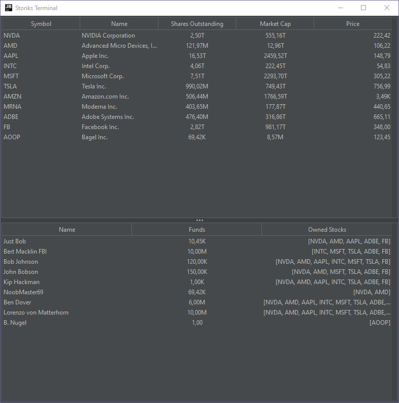
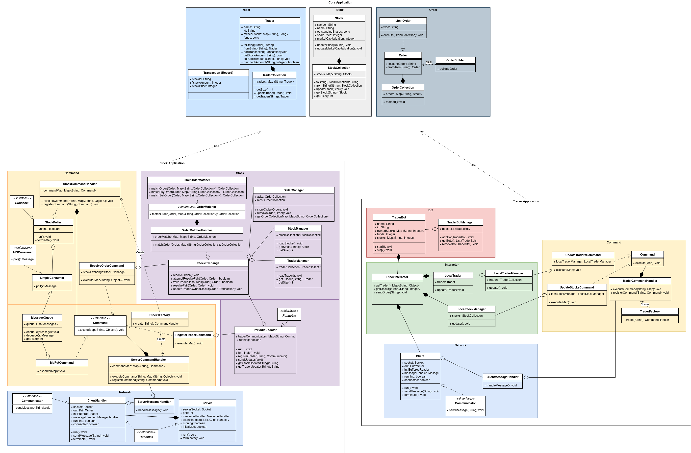

 

  <h1 align="center">Stock Market Simulation</h1>

  

    Simulation of a networked stock market with an exchange, stocks, traders, and orders.  

## About

This project was done by Stipe Frkovic and Phuong-Nam Nguyen as a part of the Advanced Object Oriented Programming course at the University of Groningen.

Over the course of the ACU (AOOP Cinematic Universe), we did the following:

1. Created and tested messages, a message queue, and interfaces for operating on the message queue.
2. Created and tested a simple network consisting of a server, its client handlers, and clients.
They can send messages to each other, which will be handled by their message and command handlers.
3. Created and tested a simulation of the stock market with stocks, traders, and orders.
The traders can send (strategic) buy and sell orders through their interactor to the stock exchange that will attempt to resolve them with existing orders.
The stock exchange will send periodic updates to the traders about their portfolio and all the stocks.
This can all be seen with a graphical user interface which will show the current status of the stocks and the traders.

## Class Diagram

## Getting Started

To get a local copy up and running follow these simple steps.

### Prerequisites

* [IntelliJ IDEA](https://www.jetbrains.com/idea/)
* [Java 17](https://www.oracle.com/java/technologies/javase/jdk17-archive-downloads.html)
* [Maven 3.8.1](https://maven.apache.org/download.cgi)
* [lombok 1.18.24](https://projectlombok.org/download)
* [junit 5.9.0](https://junit.org/junit5/)
* [logback 1.4.0](https://logback.qos.ch/)
* [awaitility](https://github.com/awaitility/awaitility)
* [mockito](https://site.mockito.org/)
* [byte-buddy 1.12.16](https://bytebuddy.net/#/)
* [gson 2.9.0](https://github.com/google/gson)
* [jackson 2.13.4](https://github.com/FasterXML/jackson-core)

### Installation

1. Navigate to the `stocks` directory
2. Load the `pom.xml` file with IntelliJ
3. Select `clean` and `install` in the Maven tab to build the project
4. Optionally select `test` to run the tests

### Running

In IntelliJ, create a compound application consisting of two applications in the following order:
`StockMain` (inside `stock-application`) and `TraderMain` (inside `trader-application`).
Select `$$MODULE_WORKING_DIR$$` as the working directory for both applications and click run!

